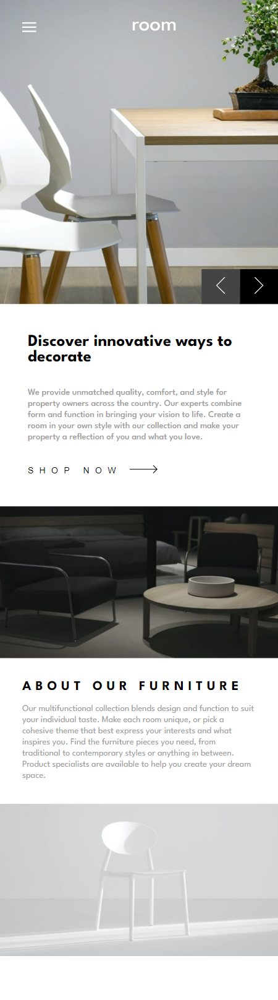
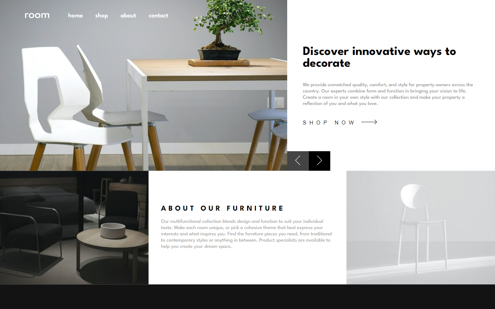

# Frontend Mentor - Room homepage solution

This is a solution to the [Room homepage challenge on Frontend Mentor](https://www.frontendmentor.io/challenges/room-homepage-BtdBY_ENq). Frontend Mentor challenges help you improve your coding skills by building realistic projects.

## Table of contents

- [Overview](#overview)
  - [The challenge](#the-challenge)
  - [Screenshot](#screenshot)
  - [Links](#links)
- [My process](#my-process)
  - [Built with](#built-with)
  - [What I learned](#what-i-learned)
  - [Continued development](#continued-development)
  - [Useful resources](#useful-resources)
- [Author](#author)

## Overview

### The challenge

Users should be able to:

- View the optimal layout for the site depending on their device's screen size
- See hover states for all interactive elements on the page
- Navigate the slider using either their mouse/trackpad or keyboard

### Screenshot

### Links

- Solution URL: [https://www.frontendmentor.io/solutions/responsive-room-homepage-using-html-css-js-g99EFC40Se](https://www.frontendmentor.io/solutions/responsive-room-homepage-using-html-css-js-g99EFC40Se)
- Live Site URL: [https://roomhomepagefrontent.netlify.app/](https://roomhomepagefrontent.netlify.app/)

## My process

### Built with

- Semantic HTML5 markup
- CSS custom properties
- Flexbox
- Responisve design

### What I learned

I improved my layout skill and also working with img in hero section which was bit confusing.

### Continued development

I will continue developing layout skill and working with images, background image etc .

### Useful resources

- [Google, Stackoverflow](https://www.google.com/) - This helped me for finding usefull ideas, ways of doing things and getting confidence.

## Author

- Website - [@Sudip Khatri](https://sudipkhatri.netlify.app/)
- Linkedin - [@Sudip Khatri](https://www.linkedin.com/in/sudip-khatri-a72a6a27b/)
- Github - [@sudipkhatr036](https://github.com/SudipKhatri036)
- Frontend Mentor - [@sudipkhatr036](https://www.frontendmentor.io/profile/SudipKhatri036)
